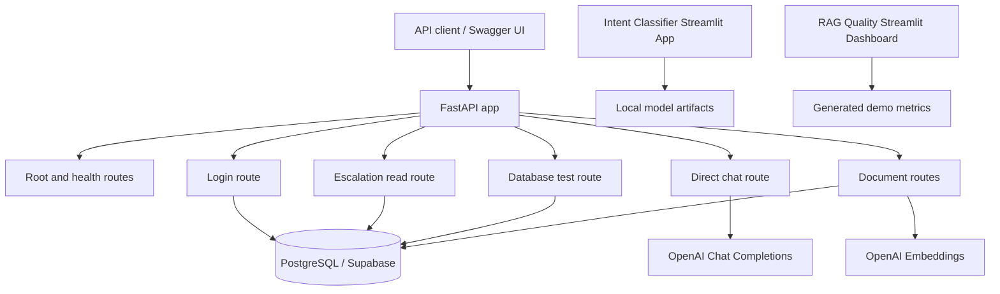
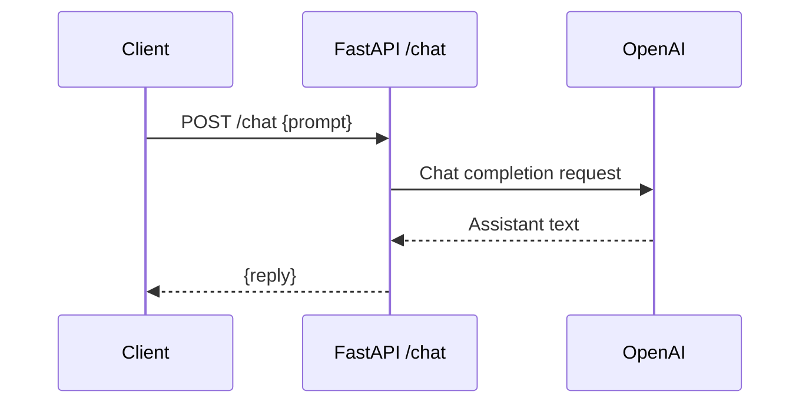
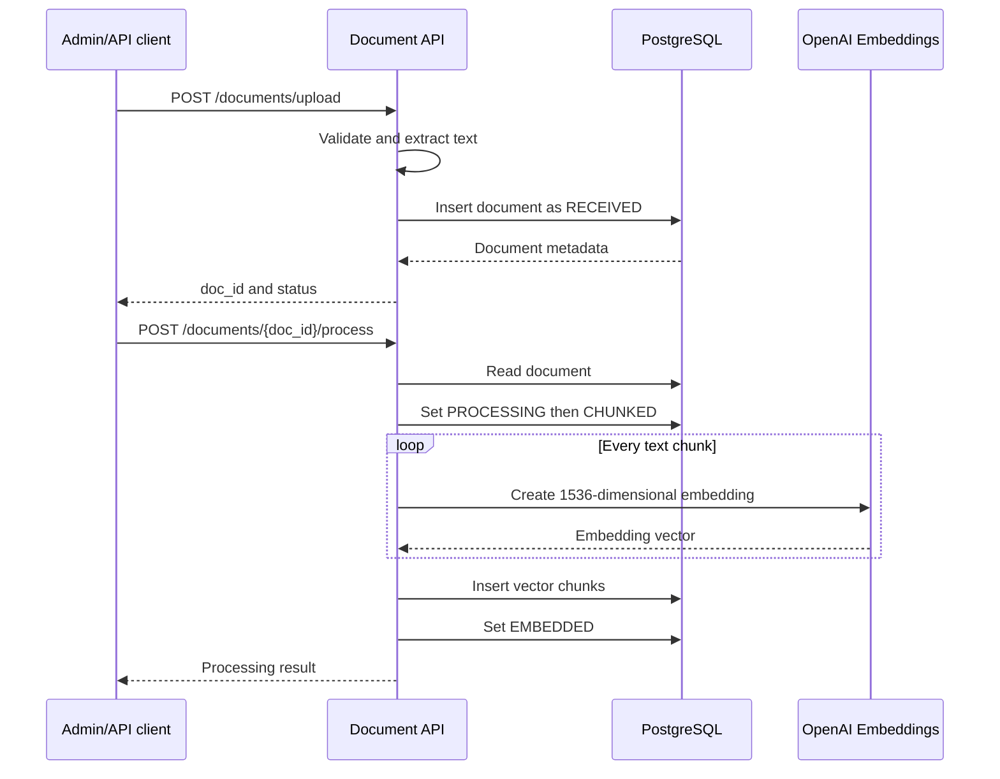
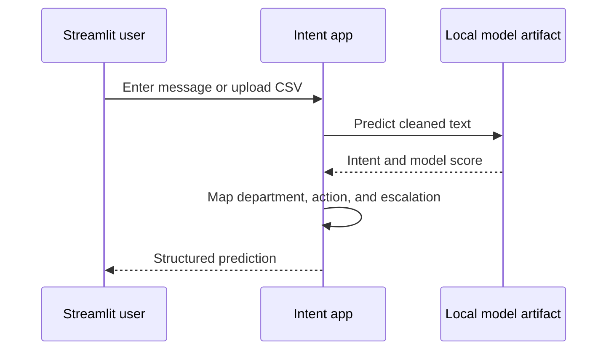
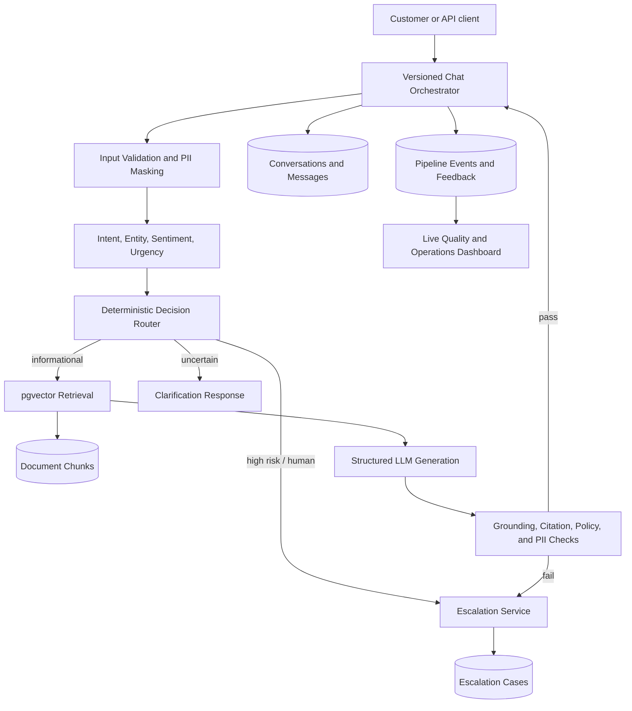
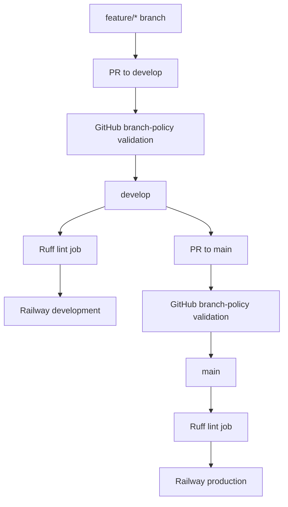

# Customer Support AI Chatbot Architecture

Last updated: July 25, 2026

## 1. Purpose

This document is the end-to-end architecture source for the Customer Support AI
Chatbot repository. It describes:

- What is implemented and runnable today
- How the current components communicate
- Where the current components are intentionally separate
- The PI-1 integration target
- The longer-term production architecture
- Data, security, reliability, deployment, and observability decisions

The repository currently contains a deployable FastAPI backend, a standalone
restaurant intent-classification application, a document ingestion and embedding
pipeline, and a demonstration RAG-quality dashboard. It does **not** yet contain
one fully connected production RAG agent. Planned behavior is therefore labeled
separately from implemented behavior throughout this document.

Related documents:

- [README.md](README.md) — product goals, requirements, roadmap, and setup
- [restaurant_intent_streamlit_app/README.md](restaurant_intent_streamlit_app/README.md)
  — standalone classifier behavior
- [Feature_built](Feature_built) — implemented-feature inventory
- [PI_1](PI_1) — next-increment feature specifications
- [RAILWAY_DEPLOYMENT.md](RAILWAY_DEPLOYMENT.md) — deployment setup
- [DEPLOYMENT_RULES.md](DEPLOYMENT_RULES.md) — branch and approval policy

## 2. Architecture status model

The following terms are used consistently:

| Status | Meaning |
|---|---|
| Implemented | Code and supporting files are present in this repository |
| Standalone | Implemented, but not connected to the primary FastAPI request path |
| Demonstration | Runnable UI based on generated/sample data rather than live services |
| PI-1 planned | Defined in `PI_1`, but not yet implemented |
| Future | Target architecture beyond PI-1 |

An implemented component may still require configured external services such as
OpenAI and PostgreSQL/Supabase before it can run successfully.

## 3. System context

The platform is intended to help restaurant or general customer-support teams
classify incoming messages, answer from approved knowledge, perform controlled
business actions, and hand unsafe or unresolved cases to humans.

Primary actors are:

| Actor | Needs |
|---|---|
| Customer | Fast, accurate, safe support responses |
| Support agent | Escalated cases with enough context to continue |
| Support manager | Operational, quality, and escalation reporting |
| Administrator | Knowledge ingestion, configuration, and access control |
| Developer | Stable APIs, deployment automation, and diagnostic information |
| Security/audit team | PII protection, authorization, and traceable decisions |

External dependencies currently used are:

- OpenAI Chat Completions for direct support responses
- OpenAI Embeddings for document vectors
- PostgreSQL/Supabase for operational data
- pgvector for vector storage and indexing
- Railway for FastAPI deployment
- GitHub Actions for branch validation, linting, and Railway deployment

## 4. Repository-level architecture

```text
Customer-Support-AI-Chatbot/
|
+-- app/
|   +-- main.py                     FastAPI assembly and health endpoints
|   +-- config.py                   Environment loading and validation
|   +-- database.py                 PostgreSQL health/test access
|   +-- routes/
|       +-- auth.py                 Credential verification
|       +-- chat.py                 Direct OpenAI chat
|       +-- documents.py            Upload, chunking, embedding, persistence
|       +-- escalated.py            Escalation-table read API
|
+-- sql/
|   +-- document_chunks.sql         pgvector table and HNSW index
|
+-- restaurant_intent_streamlit_app/
|   +-- mlapp.py                    Standalone intent-classification UI
|   +-- artifacts/                  Trained model and evaluation metadata
|
+-- datasets/
|   +-- ml_model/                   Model-training script
|   +-- restaurant_intent_model_artifacts/
|                                   Alternate artifact location
|
+-- app.py                          Demonstration RAG-quality dashboard
+-- Feature_built/                  Current feature documentation
+-- PI_1/                           Planned connected-MVP specifications
+-- .github/workflows/              Branch policy, lint, and deployment
+-- railway.toml                    Railway build and start configuration
```

There are currently three runnable application surfaces:

1. The FastAPI backend in `app/main.py`
2. The intent-classifier Streamlit app in
   `restaurant_intent_streamlit_app/mlapp.py`
3. The RAG-quality demonstration dashboard in the repository-root `app.py`

They are separate processes and do not currently call one another.

## 5. Current implemented architecture

### 5.1 Current topology



The classifier and dashboard are shown beside the API because they are implemented
repository capabilities, not steps in the current `/chat` request.

### 5.2 FastAPI application

`app/main.py` creates the application and registers all route modules.
`app/config.py` loads `.env`, configures application logging, and validates required
configuration at startup.

Required configuration:

| Variable | Required now | Purpose |
|---|---|---|
| `OPENAI_API_KEY` | Yes | Chat completion and embeddings |
| `DATABASE_URL` | Yes | PostgreSQL/Supabase connection |
| `SUPABASE_URL` | No | Reserved for Supabase client/auth integration |
| `SUPABASE_PUBLISHABLE_KEY` | No | Reserved for Supabase client/auth integration |
| `SUPABASE_JWKS_URL` | No | Reserved for JWT verification |

Because `OPENAI_API_KEY` and `DATABASE_URL` are validated during application
import, the FastAPI process fails fast when either is missing.

### 5.3 Current API surface

| Method | Path | Status | Responsibility |
|---|---|---|---|
| `GET` | `/` | Implemented | Confirms that the service is running |
| `GET` | `/health` | Implemented | Returns app status, database availability, and uptime |
| `GET` | `/database/test` | Implemented | Returns database name, user, and server version |
| `POST` | `/auth/login` | Implemented | Checks username/password and returns a stored role |
| `POST` | `/chat` | Implemented | Sends one prompt directly to OpenAI |
| `POST` | `/documents/upload` | Implemented | Extracts and stores PDF, DOCX, or TXT content |
| `POST` | `/documents/chunks` | Implemented | Embeds and upserts one text chunk |
| `POST` | `/documents/{doc_id}/process` | Implemented | Chunks and embeds a stored document |
| `GET` | `/escalated` | Implemented | Reads all rows from the escalation table |

FastAPI exposes interactive OpenAPI documentation at `/docs`.

### 5.4 Authentication and role lookup

`POST /auth/login` queries `public.app_users` by username, compares the submitted
password, and returns:

```json
{
  "message": "YES",
  "user_role": "agent"
}
```

Invalid credentials return `message: "NO"`. Operational and database errors are
translated into structured HTTP responses.

Current security boundary:

- The route performs credential lookup only.
- It does not issue a session or JWT.
- Other endpoints do not enforce the returned role.
- Password comparison is currently direct rather than hash verification.

This route is suitable for development integration, not production authentication.
PI-1 requires secure password handling or an external identity provider, signed
sessions/tokens, and endpoint authorization.

### 5.5 Direct OpenAI chat

`POST /chat` accepts:

```json
{
  "prompt": "Where is my order?"
}
```

The route calls OpenAI with the configured `gpt-4o` model and a short
customer-support system instruction, then returns:

```json
{
  "reply": "Generated support response"
}
```

Current behavior:

- One stateless prompt per request
- No conversation persistence
- No intent-classifier call
- No document retrieval
- No citations
- No business-tool calls
- No input or output guardrail pipeline
- No automatic escalation decision

### 5.6 Document ingestion and embedding

The document subsystem is the current foundation for future RAG.

#### Upload flow

```text
PDF, DOCX, or TXT upload
    -> validate extension and non-empty content
    -> extract text in memory
    -> insert document row
    -> status = RECEIVED
```

`POST /documents/upload` supports `.pdf`, `.docx`, and `.txt`. It creates a
generated document ID and stores extracted text in `public.documents`.

#### Processing flow

```text
RECEIVED
    -> PROCESSING
    -> split text into chunks up to 1,500 characters
    -> CHUNKED
    -> embed each chunk with text-embedding-3-small
    -> store vector(1536) chunks
    -> EMBEDDED

Any processing failure -> FAILED
```

`POST /documents/{doc_id}/process` performs this flow synchronously.

#### Single-chunk flow

`POST /documents/chunks` embeds one paragraph and inserts or updates it using the
`(doc_id, chunk_id)` unique key.

#### Current vector storage

The checked-in SQL creates:

- The `public.vector` extension
- `public.document_chunks`
- A 1,536-dimension vector column
- A unique `(doc_id, chunk_id)` constraint
- An HNSW cosine-distance index

The current implementation stores vectors successfully but does not provide a
similarity-search endpoint or connect retrieval to `/chat`.

### 5.7 Escalation data access

`GET /escalated` reads `public.escalated_table` and returns:

- Order ID and name
- Approver and reviewer
- Email status
- Task status

The route is read-only. It does not create escalation cases, assign agents, update
status, enforce support roles, or link escalation records to conversations.

### 5.8 Restaurant intent classifier

The standalone Streamlit app loads local scikit-learn model artifacts and maps a
customer statement to a structured routing decision:

```json
{
  "input_text": "I was charged twice for the same order.",
  "predicted_intent": "DOUBLE_CHARGED",
  "confidence": 0.99,
  "department": "Payments",
  "routing_action": "Check duplicate charge and route to payments",
  "escalation_required": true
}
```

The model output is restricted to 24 allowed intent codes.

The application provides:

- Single-message prediction
- CSV batch prediction and result download
- Model-comparison metrics
- Filterable intent catalog
- Adversarial examples
- Deployment and production notes

The selected artifact is a Complement Naive Bayes pipeline using word TF-IDF.
Metadata reports 36,000 examples, 24 classes, 1.000 accuracy, and 1.000 macro F1.
Those results come from synthetic/templated data and must not be interpreted as
production performance.

High-risk intent mappings include food-safety issues, duplicate charges, staff
complaints, cleanliness complaints, and explicit human-agent requests.

The classifier is not currently imported by the FastAPI backend. PI-1 extracts its
prediction logic into a shared service and places it in the live chat path.

### 5.9 RAG-quality dashboard

The repository-root `app.py` is a Streamlit dashboard with views for:

- Executive health
- Pipeline health
- Retrieval-method comparison
- Ingestion and chunking quality
- Retrieval quality
- Reranking and context assembly
- Answer quality and grounding
- Failure simulation
- Method recommendation
- Implementation roadmap

All displayed metrics are generated demonstration values. The dashboard does not
query PostgreSQL, document chunks, chat results, or production telemetry. PI-1
plans to introduce real event capture and replace or clearly isolate demo values.

## 6. Current end-to-end flows

### 6.1 Direct chat flow



This is the only current customer-answer path. It is not yet a RAG flow.

### 6.2 Document upload and processing flow



### 6.3 Standalone classification flow



## 7. Current data architecture

### 7.1 Tables referenced by code

| Table | Purpose | Schema source in repository |
|---|---|---|
| `public.document_chunks` | Chunk text and pgvector embeddings | Present in `sql/document_chunks.sql` |
| `public.documents` | Uploaded document text and processing status | Referenced by code; migration not checked in |
| `public.app_users` | Username, password, and role lookup | Referenced by code; migration not checked in |
| `public.escalated_table` | Escalated order/work records | Referenced by code; migration not checked in |

The absence of checked-in migrations for three referenced tables is a reproducibility
gap. PI-1 should introduce ordered, repeatable migrations for all application
tables, constraints, indexes, and access policies.

### 7.2 `document_chunks` structure

```text
id                    bigint primary key
doc_id                text
chunk_id              text
chunk_text            text
chunk_vector          vector(1536)
created_timestamp     timestamptz
last_updated          timestamptz
unique(doc_id, chunk_id)
HNSW cosine index(chunk_vector)
```

### 7.3 Current persistence limitations

- Chat conversations and messages are not stored.
- Retrieval attempts are not stored because retrieval is not implemented.
- Intent predictions are not stored by the API.
- Uploaded original files are not retained in object storage; extracted text is
  stored in PostgreSQL.
- Document processing is synchronous and has no queue/dead-letter mechanism.
- Reprocessing creates new random chunk IDs instead of replacing a stable version.
- Database access is performed directly inside route modules rather than through a
  repository/service layer.

## 8. PI-1 target architecture

PI-1 is the connected customer-support MVP described in [PI_1/README.md](PI_1/README.md).
It connects existing capabilities before adding production business tools.

### 8.1 PI-1 target topology



### 8.2 PI-1 feature sequence

| Order | Planned feature | Architectural outcome |
|---|---|---|
| 1 | Conversation orchestrator and session logging | Stable versioned chat contract and audit IDs |
| 2 | NLU integration and decision router | Classifier-driven deterministic routing |
| 3 | RAG retrieval, grounded responses, and citations | Live knowledge-backed answer path |
| 4 | Guardrails and human handoff | Safe fallback and manageable escalation cases |
| 5 | Feedback, evaluation, and observability | Measurable live quality and operational state |

### 8.3 PI-1 target request flow

```text
1. Validate authentication, request size, and idempotency key.
2. Create or load the conversation and store the customer message.
3. Mask configured PII before model calls and logging.
4. Run intent classification and deterministic entity extraction.
5. Calculate sentiment, urgency, confidence, and a route decision.
6. For knowledge questions, embed the query and retrieve active chunks.
7. Assemble a bounded context and request structured LLM output.
8. Validate grounding, citations, policy compliance, and PII safety.
9. Send the validated answer, ask for clarification, or create a handoff case.
10. Store the assistant message, route, model/retrieval metadata, and timings.
11. Return conversation ID, message ID, trace ID, response, citations, next action,
    and escalation state.
12. Accept customer feedback linked to the assistant message.
```

### 8.4 PI-1 public response contract

The planned versioned chat response is:

```json
{
  "conversation_id": "conv_...",
  "message_id": "msg_...",
  "response": "Grounded support response",
  "intent": "ORDER_STATUS",
  "confidence": 0.91,
  "citations": [
    {
      "doc_id": "doc_...",
      "chunk_id": "chunk_...",
      "document_name": "support-policy.pdf"
    }
  ],
  "next_action": "respond",
  "escalation_required": false,
  "trace_id": "trace_..."
}
```

This contract remains valid on clarification and escalation paths, using empty
citations and an appropriate `next_action`.

## 9. Target service boundaries

PI-1 may remain a modular monolith in one FastAPI deployment. Boundaries should be
expressed as service and repository modules so they can later be separated without
changing the public API.

| Module boundary | Responsibility |
|---|---|
| API routes | HTTP validation, authorization, and response mapping |
| Orchestrator | Pipeline sequencing and state transitions |
| NLU service | Intent, entities, sentiment, urgency, model metadata |
| Decision router | Pure policy-based route selection |
| Retrieval service | Query embedding, search, filtering, and context assembly |
| Generation service | Structured LLM request and response validation |
| Guardrail service | PII, injection, grounding, citation, and policy checks |
| Escalation service | Case creation, assignment, status, and audit trail |
| Repositories | Parameterized database access and transactions |
| Telemetry service | Events, timings, tokens, outcomes, and feedback |

Route modules should not own model loading, routing rules, or raw SQL after the
refactor.

## 10. Target data model

PI-1 adds or normalizes the following logical entities:

| Entity | Key content |
|---|---|
| `users` | Identity provider subject, role, status |
| `conversations` | Owner, status, last intent, assignee, timestamps |
| `messages` | Role, original/safe text policy, response, model, timestamps |
| `pipeline_runs` | Trace ID, outcome, error code, total latency |
| `nlu_results` | Intent, entities, confidence, sentiment, urgency, model version |
| `documents` | Name, type, version, status, active flag, source metadata |
| `document_chunks` | Stable chunk ID, source/page metadata, text, vector |
| `retrieval_events` | Query, ranked chunk IDs, scores, filters, latency |
| `escalation_cases` | Reason, severity, summary, assignee, status, timestamps |
| `escalation_events` | Case-state audit trail and actor |
| `feedback` | Message-linked rating, reason, comment, timestamps |
| `application_events` | Structured operational and quality events |

All tables should use migrations, explicit foreign keys, useful indexes, UTC
timestamps, and documented retention. B2B multi-tenancy is a future concern, but
schemas should avoid choices that prevent adding `tenant_id`.

## 11. Retrieval and generation design

### 11.1 PI-1 retrieval baseline

PI-1 uses the database already present in the project:

```text
Customer query
    -> text-embedding-3-small
    -> pgvector cosine search
    -> active-document and metadata filters
    -> overlap deduplication
    -> top-K chunks
    -> token-bounded context
```

This avoids adding a second vector platform before the pgvector baseline has been
measured.

### 11.2 Future hybrid retrieval

After the baseline is evaluated, the retrieval interface may add:

- PostgreSQL full-text search or OpenSearch BM25
- Reciprocal-rank or weighted result fusion
- Cross-encoder or LLM reranking
- Query rewriting
- Metadata-aware access control
- Semantic answer cache

These are future capabilities, not current dependencies.

### 11.3 Grounded generation rules

- Only active, authorized chunks may enter model context.
- Every factual knowledge claim should be supported by retrieved context.
- Every returned citation must reference a chunk in the retrieval set.
- A low-quality or empty result must lead to clarification or escalation.
- Prompt and model versions must be recorded.
- Context and output lengths must be bounded.
- The model may recommend a next action but must not perform privileged actions
  outside an approved tool boundary.

## 12. Decision and escalation policy

The target router is deterministic around model output:

| Condition | Target action |
|---|---|
| High-confidence informational intent | Retrieve knowledge and answer |
| Medium confidence | Retrieve cautiously or ask a clarification |
| Low confidence | Clarify or hand off |
| Explicit human request | Immediate handoff |
| Food safety, fraud, legal, or chargeback | Immediate high-priority handoff |
| Order/refund action without an approved tool | Hand off |
| No relevant source | Do not invent; clarify or hand off |
| Guardrail failure | Block generated answer and hand off |
| Dependency failure after bounded retry | Safe error response and handoff when needed |

Thresholds, high-risk intents, and allowed automated actions must be versioned
configuration rather than hard-coded independently in multiple modules.

## 13. Security and trust boundaries

### 13.1 Current gaps

- Plain password comparison
- No issued token or session
- No endpoint-level RBAC
- No PII masking before OpenAI calls
- No rate limiting
- Raw third-party exception text may be exposed by `/chat`
- Referenced database schemas and row-level policies are incomplete in the repository

### 13.2 Target controls

| Area | Control |
|---|---|
| Authentication | OIDC/JWT or secure signed sessions |
| Authorization | Customer, support-agent, admin, and auditor roles |
| Transport | TLS for every external connection |
| Secrets | Environment/secret manager only; never logs or prompts |
| Passwords | External identity provider or salted adaptive hash |
| PII | Detect and mask before logs and external model calls |
| Prompt injection | Treat user and retrieved content as untrusted data |
| Database | Least-privilege roles, parameterized queries, optional RLS |
| Documents | Type/size limits, parsing isolation, malware scanning in production |
| Tool calls | Allowlisted schemas, authorization, idempotency, approval for risk |
| Audit | Actor, action, resource, outcome, model/prompt version, timestamp |
| Retention | Configurable retention, deletion, and export workflows |

Original and masked message storage must be a deliberate policy choice. If original
content must be retained, access should be restricted and its retention shorter
than general operational metrics where possible.

## 14. Reliability and failure handling

| Failure | Current behavior | Target behavior |
|---|---|---|
| Missing configuration | Application fails at startup | Keep fail-fast validation |
| Database unavailable | Health degrades; routes return errors | Sanitized error, trace, alert, bounded retry |
| OpenAI chat failure | `/chat` returns HTTP 500 | Timeout, bounded retry, safe response/handoff |
| Embedding failure | Chunk route returns 502; processing fails | Retry policy, resumable job, failed-item record |
| Document parse failure | Upload returns 422 | Preserve clear validation and safe diagnostics |
| No retrieval result | Not applicable | Clarify or hand off; never fabricate |
| Invalid citation | Not applicable | Block answer and record guardrail failure |
| Classifier artifact missing | Standalone UI stops with error | Readiness failure and safe router fallback |
| Duplicate client request | May duplicate work | Idempotency key and stored result |
| Long document | Synchronous request may run long | Future queue/worker and job-status endpoint |

Transactions should keep message, pipeline, retrieval, and escalation state
consistent. External calls must use explicit timeouts, and retries must only be used
for safe/idempotent operations.

## 15. Observability and evaluation

### 15.1 Current state

- Python logging is configured centrally.
- Health reports uptime and basic database availability.
- The RAG dashboard is demonstration-only.
- No stored end-to-end traces or production quality metrics exist.

### 15.2 PI-1 telemetry

Each chat request should record:

```text
trace_id
conversation_id
message_id
user_id or pseudonymous subject
intent and confidence
route and escalation reason
retrieved chunk IDs, ranks, and scores
model and prompt version
token counts
latency by pipeline stage
guardrail outcomes
dependency errors and retries
final outcome
feedback
```

Logs must exclude secrets and unmasked PII.

### 15.3 Target dashboards

| Dashboard | Metrics |
|---|---|
| Support operations | Volume, automated resolution, clarification, escalation |
| AI quality | Feedback, groundedness, citation validity, guardrail blocks |
| RAG health | Hit rate, empty results, Recall@K, ranking quality, latency |
| Reliability | Error rate, dependency health, retries, latency percentiles |
| Cost | Input/output tokens, embedding volume, estimated cost |
| Security | Injection detections, authorization failures, sensitive-case volume |

### 15.4 Evaluation

A versioned golden set should contain expected intent, entities, route, source
document/chunk, answer facts, escalation decision, and safety tags.

Initial evaluation gates should cover:

- Intent accuracy and macro F1
- Confidence calibration
- Entity precision/recall
- Retrieval Recall@K and MRR
- Citation validity
- Answer groundedness
- Missed and unnecessary escalations
- PII leakage and policy violations
- P95 latency and dependency error rate

Synthetic classifier results remain a development baseline. Production readiness
requires messy, real-world, reviewed customer examples.

## 16. Deployment architecture

### 16.1 Current FastAPI deployment



Railway uses Nixpacks and starts:

```text
uvicorn app.main:app --host 0.0.0.0 --port $PORT
```

The restart policy retries failed processes up to three times.

The current workflow job is named “Lint and test,” but it runs Ruff only; no
automated test suite is invoked. PI-1 should add unit, integration, migration, and
API-contract tests before deployment.

### 16.2 Streamlit applications

The classifier and RAG-quality dashboard are not part of the current Railway start
command. They must be run separately:

```text
streamlit run restaurant_intent_streamlit_app/mlapp.py
streamlit run app.py
```

If these become deployed operator applications, they should have independent
services, access controls, health checks, and dependency manifests.

### 16.3 Future scaling path

| Stage | Architecture |
|---|---|
| Current/PI-1 | Modular FastAPI service, PostgreSQL/pgvector, provider APIs |
| Growth | Redis cache, asynchronous ingestion worker, object storage |
| Higher scale | Separate orchestration/retrieval/ingestion services and queue |
| Enterprise | Multi-region services, tenant isolation, managed search, SIEM |

Service separation should follow measured load, reliability, or ownership needs;
it is not required merely to match the conceptual diagram.

## 17. Future tool and agent architecture

Business actions are intentionally outside PI-1. A later increment may introduce an
MCP-based tool gateway:

| Tool domain | Example operations |
|---|---|
| Orders | Get status and delivery estimate |
| Refunds | Check policy eligibility and start an approval case |
| Tickets | Create and update a support ticket |
| CRM | Read an authorized customer profile and append notes |
| Knowledge | Search FAQ or read an approved policy chunk |

Tool requirements:

- Strict input/output schemas
- Customer and agent authorization
- Tool-specific allowlists
- Idempotency for mutations
- Timeouts and bounded retries
- Complete audit events
- Human approval for refunds, credits, account changes, or other risky actions

LangGraph or another state-machine framework may be evaluated for multi-step
workflows after the deterministic PI-1 orchestrator is measured. It is not a
current runtime dependency.

## 18. Current-to-target status matrix

| Component | Current state | PI-1 target | Later target |
|---|---|---|---|
| FastAPI foundation | Implemented | Versioned modular API | Independently scalable services if needed |
| Health/database checks | Implemented | Readiness for all critical dependencies | Full service-level monitoring |
| Authentication | Credential lookup only | Secure session/token and RBAC | Enterprise OIDC and tenant policies |
| Chat | Stateless direct LLM call | Stateful orchestrated pipeline | Model routing and workflow agents |
| Intent classification | Standalone 24-class app | Shared backend NLU service | Real-data retraining and multilingual NLU |
| Entity/sentiment extraction | Not implemented | Initial deterministic/approved methods | Advanced calibrated models |
| Document ingestion | Implemented synchronously | Versioned, reproducible knowledge records | Queue workers and object storage |
| Vector storage | Implemented in pgvector | Live similarity retrieval | Hybrid search and reranking |
| Grounded answers/citations | Not implemented | Structured RAG answers with validation | Advanced attribution and evaluation |
| Escalation | Read-only table endpoint | Case creation, assignment, status, audit | External ticketing/CRM synchronization |
| Guardrails | Not implemented | Input/output checks and safe fallback | Policy engine and red-team automation |
| Feedback | Not implemented | Message-linked feedback API | Experimentation and retraining loop |
| Observability | Logs and demo dashboard | Stored traces and live dashboard | OpenTelemetry/SIEM integration |
| MCP tools | Not implemented | Out of scope | Order, refund, ticket, and CRM tools |
| Multi-agent workflow | Not implemented | Out of scope | Controlled state-machine workflows |

## 19. Technology decisions

| Area | Current or planned decision | Rationale |
|---|---|---|
| API framework | FastAPI | Typed Python APIs and OpenAPI documentation |
| Primary database | PostgreSQL/Supabase | Relational operational data and managed hosting |
| Vector baseline | pgvector | Already implemented; avoids another data platform |
| Embedding model | `text-embedding-3-small`, 1,536 dimensions | Matches current schema and ingestion code |
| Chat model | `gpt-4o` in current route | Existing implementation; make configurable in PI-1 |
| Intent model | TF-IDF + Complement Naive Bayes | Small, fast, local baseline with fixed classes |
| Classifier UI | Streamlit | Rapid model inspection and batch prediction |
| Analytics UI | Streamlit + Plotly | Rapid quality-dashboard prototyping |
| Hosting | Railway | Existing deployment configuration and environments |
| CI/CD | GitHub Actions | Existing branch governance and Railway automation |
| Future cache | Redis | Session/cache/rate-limit use when justified |
| Future workflow | LangGraph evaluation | Candidate for controlled multi-step state |
| Future tool protocol | MCP | Schema-defined business-tool boundary |

Model names, thresholds, timeouts, top-K, and high-risk intent lists should become
validated configuration rather than source-code constants.

## 20. Architectural risks and technical debt

Highest-priority risks are:

1. Authentication is not production safe and does not authorize endpoints.
2. The direct chat route can answer without company knowledge or citations.
3. The classifier's perfect synthetic-data metrics may overstate real accuracy.
4. Three database tables referenced by code lack checked-in migrations.
5. Document processing is synchronous and may time out for large files.
6. Reprocessing documents can create duplicate logical chunks.
7. Route modules mix HTTP, business logic, external clients, and raw SQL.
8. OpenAI and database clients lack consistent timeout/retry/circuit-breaker policy.
9. The dashboard may be mistaken for live monitoring despite using generated data.
10. CI runs linting but no automated tests.
11. Error handling is inconsistent; `/chat` may expose third-party exception text.
12. No conversation, retrieval, prompt-version, token, or feedback audit trail exists.

PI-1 addresses items 2, 7, 8, 11, and 12 directly and begins addressing items 1,
3, 4, 9, and 10. Asynchronous ingestion remains a later scaling improvement unless
document size or latency requires it sooner.

## 21. Architecture principles

All new implementation should follow these principles:

1. **Current versus planned must stay explicit.** Documentation and dashboards must
   never present generated or future behavior as live production capability.
2. **Safe fallback beats unsupported automation.** Low confidence, missing evidence,
   or policy uncertainty must result in clarification or human handoff.
3. **Deterministic policy surrounds probabilistic models.** Models may classify and
   draft; code enforces routing, authorization, citations, and action limits.
4. **Every decision is traceable.** Store stable IDs, model/prompt versions,
   retrieval evidence, guardrail outcomes, and human actions.
5. **PII and secrets are minimized.** Do not place unmasked sensitive data in logs,
   prompts, telemetry, or escalation summaries.
6. **Public contracts are versioned.** Internal model, retrieval, and tool choices
   can evolve without breaking clients.
7. **Modular monolith first.** Separate services only when scale, reliability, or
   ownership creates a concrete need.
8. **Migrations make data reproducible.** Every required database object belongs in
   version-controlled migration history.
9. **Quality gates precede autonomy.** Retrieval, safety, and escalation evaluation
   must pass before enabling broader automated actions.
10. **Human approval protects high-risk changes.** Refunds, credits, account changes,
    and sensitive cases remain controlled actions.

## 22. Definition of the connected MVP

The architecture reaches the connected-MVP milestone when:

- A customer can create and continue a stored conversation.
- The API classifies intent and applies a recorded route decision.
- Informational questions retrieve active knowledge chunks.
- Customer-facing factual answers include valid citations.
- Low-confidence, unsafe, unsupported, or ungrounded cases create a human handoff.
- Support roles can inspect and update assigned escalation cases.
- Each response has a trace ID and per-stage operational records.
- Customer feedback links to the exact assistant response.
- The dashboard shows reconciled live data rather than generated metrics.
- Automated tests cover success, no-result, dependency failure, authorization, and
  escalation paths.

Until these conditions are met, the repository should be described as a collection
of implemented backend, ML, ingestion, and demonstration capabilities progressing
toward a connected customer-support platform.
