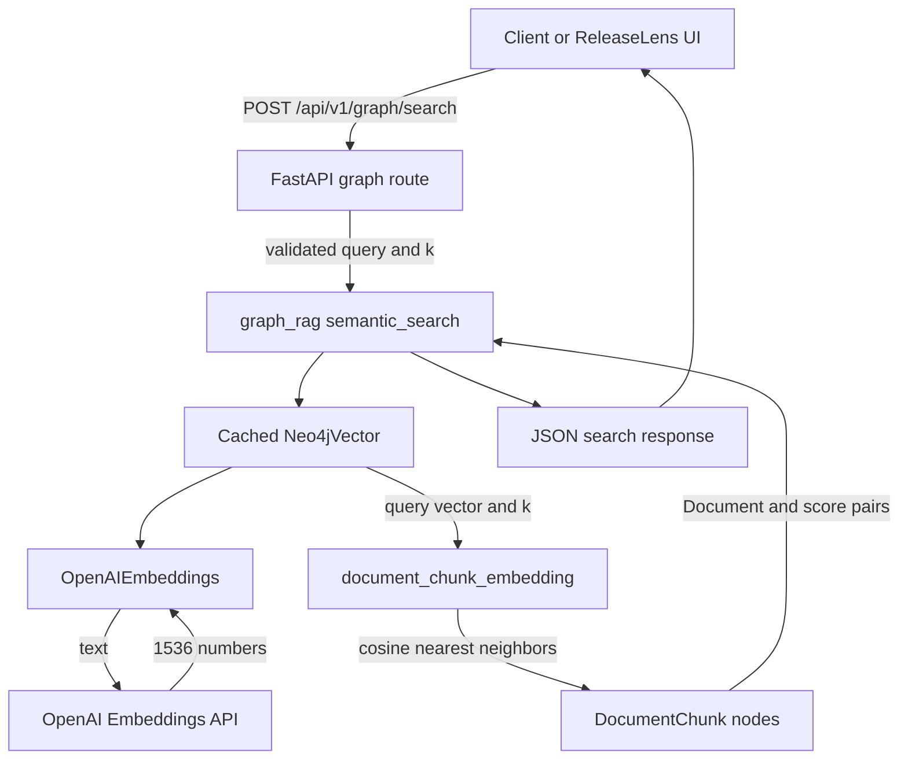

# Graph RAG flow

This document explains how ReleaseLens converts a user search query into an
OpenAI embedding, searches the Neo4j vector index, and returns the nearest
`DocumentChunk` nodes through FastAPI and LangChain.

## What is currently implemented

The current `/api/v1/graph/search` endpoint is a semantic retrieval endpoint. It
returns matching chunks and similarity scores. It does not yet send those chunks
to a chat model to generate a final natural-language answer.

```text
User query
   |
   v
FastAPI POST /api/v1/graph/search
   |
   v
LangChain OpenAIEmbeddings
   |
   v
1536-dimensional query vector
   |
   v
Neo4j document_chunk_embedding vector index
   |
   v
Nearest DocumentChunk nodes
   |
   v
JSON results containing text, score, and metadata
```

## Component architecture



## Files involved

| File | Responsibility |
|---|---|
| `app/routes/graph.py` | Validates HTTP requests and formats HTTP responses. |
| `app/services/graph_rag.py` | Creates LangChain graph/vector integrations and runs semantic search. |
| `app/neo4j_client.py` | Provides the process-scoped official Neo4j driver. |
| `app/config.py` | Loads OpenAI and Neo4j configuration. |
| `infra/neo4j/.env` | Stores ignored local Neo4j credentials and connection values. |
| `infra/neo4j/migrations/V005__vector_index_1536.cypher` | Creates the vector index. |
| `infra/neo4j/migrations/V006__seed_development_data.cypher` | Creates example documents and chunks without fake embeddings. |

## Phase 1: prepare searchable data

Vector search requires `DocumentChunk` nodes with real embeddings. Creating a
vector index alone does not generate embeddings.

The required data preparation flow is:

```text
Source document
   |
   v
Extract text
   |
   v
Split text into chunks
   |
   v
OpenAIEmbeddings.embed_documents(...)
   |
   v
One 1536-dimensional embedding per chunk
   |
   v
MERGE Document and DocumentChunk nodes
   |
   v
Store chunk.embedding in Neo4j
   |
   v
Neo4j automatically indexes the embedding
```

Each searchable chunk must resemble:

```cypher
(:DocumentChunk {
  id: 'stable-application-id',
  chunk_index: 0,
  text: 'The searchable chunk text',
  token_count: 42,
  embedding: [0.0123, -0.0456, ...]
})
```

The `embedding` list must contain exactly 1536 finite numeric values because the
current index was created with:

```cypher
CREATE VECTOR INDEX document_chunk_embedding IF NOT EXISTS
FOR (chunk:DocumentChunk) ON (chunk.embedding)
OPTIONS {indexConfig: {
  `vector.dimensions`: 1536,
  `vector.similarity_function`: 'cosine'
}};
```

The development seed creates meaningful chunk text but deliberately does not
store fake embeddings. Therefore, semantic search can return zero results until
real embeddings are added to those or other `DocumentChunk` nodes.

The existing ReleaseLens document-ingestion service currently stores document
embeddings in PostgreSQL/pgvector. Automatic synchronization of those embeddings
into Neo4j is not yet implemented. If the same chunk is stored in both databases,
use the same stable chunk UUID in PostgreSQL and Neo4j.

## Phase 2: receive and validate the query

The client calls:

```http
POST /api/v1/graph/search
Content-Type: application/json
```

Example request:

```json
{
  "query": "How does graph-aware document retrieval work?",
  "k": 5
}
```

`GraphSearchRequest` in `app/routes/graph.py` validates:

- `query` is present and contains between 1 and 4000 characters.
- `k` is between 1 and 20.
- `k` defaults to 5 when omitted.

Invalid input is rejected by FastAPI before LangChain or Neo4j is called.

## Phase 3: create or reuse the LangChain vector store

The route calls:

```python
semantic_search(request.query, request.k)
```

`semantic_search()` calls the cached `get_vector_store()` function. On its first
use in a FastAPI process, `get_vector_store()` creates:

1. An `OpenAIEmbeddings` client.
2. A `Neo4jVector` connected to the existing Neo4j vector index.

The important configuration is:

```python
OpenAIEmbeddings(
    model=OPENAI_EMBEDDING_MODEL,
    dimensions=OPENAI_EMBEDDING_DIMENSIONS,
)

Neo4jVector.from_existing_index(
    embeddings,
    index_name="document_chunk_embedding",
    node_label="DocumentChunk",
    text_node_property="text",
    embedding_node_property="embedding",
)
```

`from_existing_index` does not create a second index. It connects LangChain to
the index created by migration V005.

The `@lru_cache(maxsize=1)` decorators prevent new LangChain connections from
being constructed for every request. The objects are reused for the lifetime of
the FastAPI process.

## Phase 4: convert the user query into a vector

LangChain passes the query text to `OpenAIEmbeddings`. The configured model is
read from the root application environment:

```text
OPENAI_EMBEDDING_MODEL=text-embedding-3-small
OPENAI_EMBEDDING_DIMENSIONS=1536
```

OpenAI returns a list containing 1536 floating-point values. The query vector and
stored chunk vectors must have the same dimension.

Conceptually:

```text
"How does graph-aware retrieval work?"

becomes

[0.0214, -0.0087, 0.0341, ..., -0.0112]
```

The vector is a semantic representation. Queries and chunks can match even when
they do not contain exactly the same words.

## Phase 5: search Neo4j

`Neo4jVector.similarity_search_with_score(query, k=k)` sends the query vector to
the `document_chunk_embedding` index.

Neo4j compares the query vector with indexed `DocumentChunk.embedding` values
using cosine similarity. It returns up to `k` nearest chunks ordered by score.

The logical operation is:

```text
query embedding
      |
      v
document_chunk_embedding
      |
      +-- compare with chunk A embedding
      +-- compare with chunk B embedding
      +-- compare with chunk C embedding
      |
      v
top k nearest chunks
```

Only chunks that have a valid `embedding` property are included in vector search.

## Phase 6: format the API response

LangChain returns `(Document, score)` pairs. `semantic_search()` converts each
pair to a serializable object:

```python
{
    "text": document.page_content,
    "score": score,
    "metadata": document.metadata,
}
```

The route returns:

```json
{
  "query": "How does graph-aware document retrieval work?",
  "results": [
    {
      "text": "ReleaseLens uses Neo4j for graph relationships...",
      "score": 0.91,
      "metadata": {
        "id": "chunk-id"
      }
    }
  ],
  "count": 1
}
```

If no chunks have embeddings, or none qualify as nearest neighbors, `results`
can be empty:

```json
{
  "query": "How does graph-aware document retrieval work?",
  "results": [],
  "count": 0
}
```

## Related graph endpoints

### Health

```http
GET /api/v1/graph/health
```

This endpoint uses the official Neo4j driver, verifies Bolt connectivity, and
returns the Neo4j version. It does not call OpenAI.

### Schema

```http
GET /api/v1/graph/schema
```

This endpoint uses `Neo4jGraph.refresh_schema()` to return labels, properties,
and relationships discovered in Neo4j. It does not perform vector search.

## Configuration loading

`app/config.py` loads configuration in this order:

1. Root `.env` for OpenAI, PostgreSQL, and application settings.
2. `infra/neo4j/.env` for Neo4j settings.
3. Already-exported operating-system variables take precedence.

The graph integration requires:

```text
OPENAI_API_KEY
OPENAI_EMBEDDING_MODEL
OPENAI_EMBEDDING_DIMENSIONS
NEO4J_URI
NEO4J_USERNAME
NEO4J_PASSWORD
NEO4J_DATABASE
NEO4J_VECTOR_INDEX
```

Secrets are never included in API responses or application logs.

## Connection lifecycle

The official driver and LangChain integrations are process-scoped:

```text
FastAPI process starts
   |
   v
First graph request creates cached clients
   |
   v
Later requests reuse those clients
   |
   v
FastAPI lifespan shutdown
   |
   v
close_langchain_resources()
close_neo4j_client()
```

This avoids creating a new driver and connection pool for every HTTP request.

## Failure behavior

The graph routes return HTTP `503` with `NEO4J_UNAVAILABLE` when Neo4j is stopped,
authentication fails, Bolt is unreachable, or the graph configuration is
missing.

Check the standalone database verification when this happens:

```powershell
.\.venv\Scripts\python.exe .\infra\neo4j\scripts\neo4j_verify.py
```

If verification succeeds but FastAPI still returns `503`, restart Uvicorn so it
loads the current code and environment.

## Testing the retrieval endpoint

Start Neo4j and FastAPI:

```powershell
docker compose --env-file .\infra\neo4j\.env -f .\infra\neo4j\compose.yaml up -d
.\.venv\Scripts\python.exe .\infra\neo4j\scripts\wait_for_neo4j.py
.\.venv\Scripts\python.exe .\infra\neo4j\scripts\neo4j_migrate.py
.\.venv\Scripts\python.exe .\infra\neo4j\scripts\neo4j_verify.py
.\.venv\Scripts\python.exe -m uvicorn app.main:app --reload --port 8003
```

Then call semantic search from a second PowerShell terminal:

```powershell
$body = @{
    query = "Neo4j graph RAG architecture"
    k = 5
} | ConvertTo-Json

Invoke-RestMethod `
    -Method Post `
    -Uri "http://127.0.0.1:8003/api/v1/graph/search" `
    -ContentType "application/json" `
    -Body $body
```

## Extending retrieval into full RAG answer generation

The next layer for a complete question-answering workflow would be:

```text
User question
   |
   v
OpenAI query embedding
   |
   v
Neo4j vector retrieval
   |
   v
Top matching chunks plus graph context
   |
   v
Prompt construction
   |
   v
ChatOpenAI or another LangChain chat model
   |
   v
Grounded answer with chunk/document citations
```

That answer-generation stage is not part of the current graph search endpoint.
It should be added only after document embeddings are synchronized into Neo4j
and Project-level access filters are included in retrieval.

